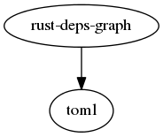
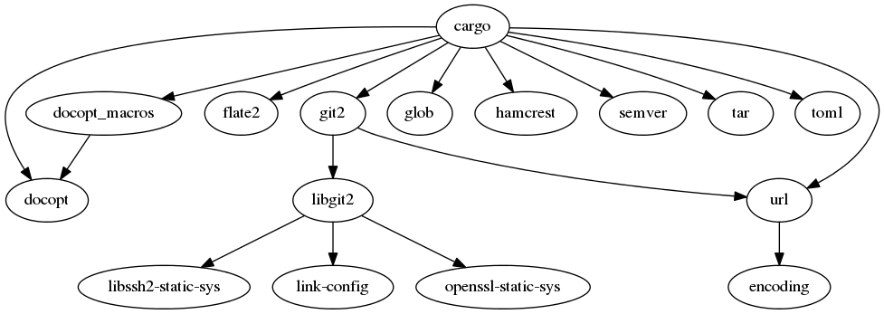

rust-deps-graph
===============

A tool to graph transitive dependencies for rust projects using Cargo

Usage
-----
In a rust project using Cargo, run the following commands (assuming
rust-deps-graph is on your PATH)
```sh
cargo update # If you don't have a Cargo.lock file
rust-deps-graph
dot -Tsvg Cargo.dot > Cargo.svg
```

Examples
--------





