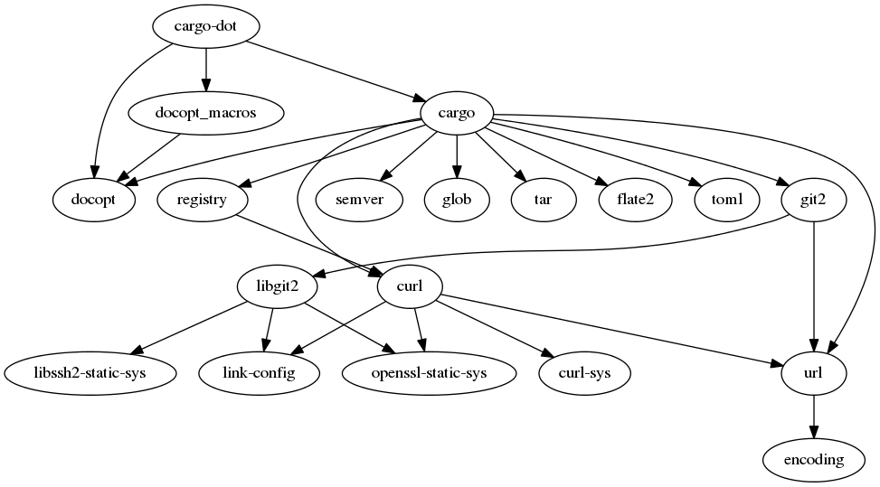
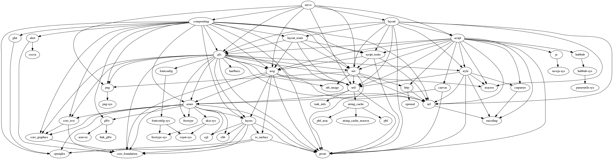

cargo-dot [](https://travis-ci.org/maxsnew/cargo-dot)
=====================

A tool to graph transitive dependencies for Rust projects using Cargo

Installation
------------
In this project's directory, build the project and then add the binary to your `PATH`.
```sh
cargo build
export PATH=$PATH:`pwd`/target/debug
```

This will likely fail when used with the latest Rust nightly. If so, try
```sh
cargo update
```

and then repeat the above steps. If it then succeeds, please submit a
pull request with the new `Cargo.lock`. If it still fails, it is
likely because Cargo is not updated to the latest nightly, which is
common.

Hopefully this will not be a problem once the beta starts and the
nightlies are no longer the recommended installation method. See
[here](http://blog.rust-lang.org/2015/02/13/Final-1.0-timeline.html)
for details on the official timeline.

Usage
-----
In a Rust project using Cargo, run the following commands (assuming
cargo-dot is on your PATH)
```sh
cargo build # If you don't have a Cargo.lock file
cargo dot | dot -Tsvg > Cargo.svg
```

Examples
--------
This project's dependencies


Servo's dependencies

