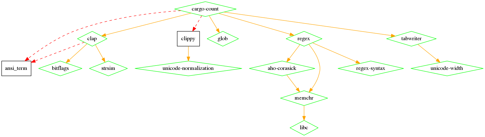
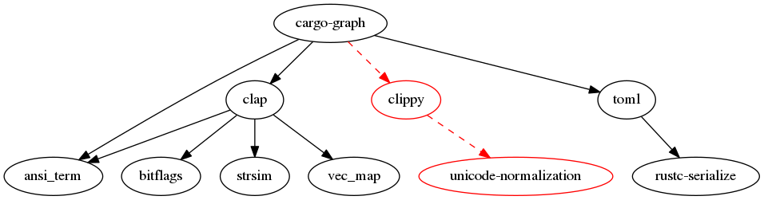

# cargo-graph

Linux: [](https://travis-ci.org/kbknapp/cargo-graph)

A `cargo` subcommand for building GraphViz DOT files of dependency graphs. This subcommand was originally based off and inspired by the project [cargo-dot](https://github.com/maxsnew/cargo-dot) by [Max New](https://github.com/maxsnew)


## Demo

Let's say we wanted to build a dependency graph of [cargo-count](https://github.com/kbknapp/cargo-count) but we wanted optional dependencies to use red dashed lines and black boxes, and regular (aka "build") dependencies to use orange lines to green diamons, one would run the following.

**NOTE:** GraphViz `dot` needs to be installed to produce the .PNG from the dotfile

```
$ cargo graph --optional-line-style dashed --optional-line-color red --optional-shape box --build-shape diamond --build-color green --build-line-color orange > cargo-count.dot
$ dot -Tpng > rainbow-graph.png cargo-count.dot
```

**NOTE:** It's also possible to run `cargo graph [options] | dot [options] > [file]` instead of individual commands

The above commands would produce the following graph:



Now, *why* someone would do that to a graph is a different story...but it's possible :)

## Installing

`cargo-graph` can be installed with `cargo install`

```
$ cargo install cargo-graph
```

This may require a nightly version of `cargo` if you get an error about the `install` command not being found. You may also compile and install the traditional way by followin the instructions below.


## Compiling

Follow these instructions to compile `cargo-count`, then skip down to Installation.

 1. Ensure you have current version of `cargo` and [Rust](https://www.rust-lang.org) installed
 2. Clone the project `$ git clone https://github.com/kbknapp/cargo-graph && cd cargo-graph`
 3. Build the project `$ cargo build --release` (**NOTE:** There is a large performance differnce when compiling without optimizations, so I recommend alwasy using `--release` to enable to them)
 4. Once complete, the binary will be located at `target/release/cargo-graph`

## Installation and Usage

All you need to do is place `cargo-graph` somewhere in your `$PATH`. Then run `cargo graph` anywhere in your project directory. For full details see below.

### Linux / OS X

You have two options, place `cargo-graph` into a directory that is already located in your `$PATH` variable (To see which directories those are, open a terminal and type `echo "${PATH//:/\n}"`, the quotation marks are important), or you can add a custom directory to your `$PATH`

**Option 1**
If you have write permission to a directory listed in your `$PATH` or you have root permission (or via `sudo`), simply copy the `cargo-graph` to that directory `# sudo cp cargo-graph/usr/local/bin`

**Option 2**
If you do not have root, `sudo`, or write permission to any directory already in `$PATH` you can create a directory inside your home directory, and add that. Many people use `$HOME/.bin` to keep it hidden (and not clutter your home directory), or `$HOME/bin` if you want it to be always visible. Here is an example to make the directory, add it to `$PATH`, and copy `cargo-graph` there.

Simply change `bin` to whatever you'd like to name the directory, and `.bashrc` to whatever your shell startup file is (usually `.bashrc`, `.bash_profile`, or `.zshrc`)

```sh
$ mkdir ~/bin
$ echo "export PATH=$PATH:$HOME/bin" >> ~/.bashrc
$ cp cargo-graph~/bin
$ source ~/.bashrc
```

### Windows

On Windows 7/8 you can add directory to the `PATH` variable by opening a command line as an administrator and running

```sh
C:\> setx path "%path%;C:\path\to\cargo-graph\binary"
```

Otherwise, ensure you have the `cargo-graph` binary in the directory which you operating in the command line from, because Windows automatically adds your current directory to PATH (i.e. if you open a command line to `C:\my_project\` to use `cargo-graph` ensure `cargo-graph.exe` is inside that directory as well).


### Options

There are a few options for using `cargo-graph` which should be somewhat self explanitory.

```
USAGE:
    cargo [FLAGS] [OPTIONS] [--] [ARGS]

FLAGS:
    -S, --follow-symlinks      Follows symlinks and counts source files it finds
                               (Defaults to false when omitted)
    -h, --help                 Prints help information
        --unsafe-statistics    Displays lines and percentages of "unsafe" code
    -V, --version              Prints version information
    -v, --verbose              Print verbose output

OPTIONS:
    -l, --language <exts>...    Only count these languges (by source code extension)
                                (i.e. '-l js py cpp')
    -e, --exclude <paths>...    Files or directories to exclude (automatically includes '.git')
        --utf8-rule <rule>      Sets the UTF-8 parsing rule (Defaults to 'strict')
                                 [values: ignore lossy strict]
    -s, --separator <sep>       Set the thousands separator for pretty printing

ARGS:
    to_count...    The files or directories (including children) to count
                   (defaults to current working directory when omitted)

When using '--exclude <path>' the path given can either be relative to the current 
directory, or absolute. When '<path>' is a file, it must be relative to the current 
directory or it will not be found. Example, if the current directory has a child 
directory named 'target' with a child fild 'test.rs' and you use `--exclude target/test.rs' 

Globs are also supported. For example, to eclude 'test.rs' files from all child directories 
of the current directory you could do '--exclude */test.rs'.
```

## License

`cargo-graph` is released under the terms of the MIT. See the LICENSE-MIT file for the details.

## Dependencies Tree

